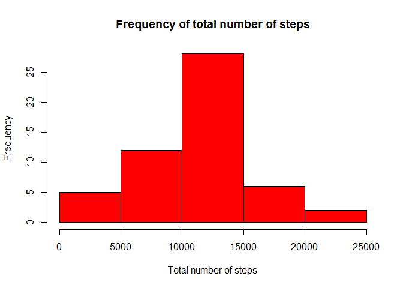
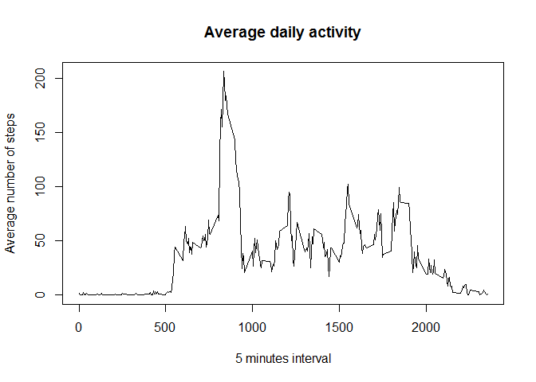
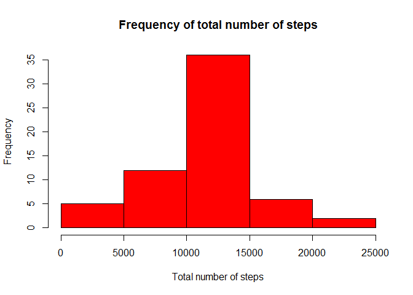
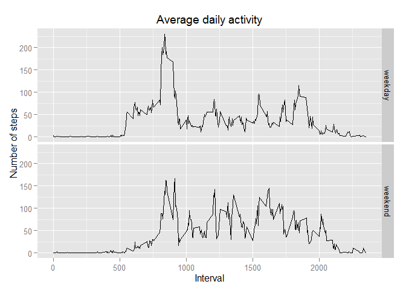

# Reproducible Research: Peer Assessment 1


## Loading and preprocessing the data
The GitHub repository contains the dataset for the assignment. Please, unzip the file

```r
activity <- read.csv("activity.csv")
summary(activity)
```

```
##      steps                date          interval     
##  Min.   :  0.00   2012-10-01:  288   Min.   :   0.0  
##  1st Qu.:  0.00   2012-10-02:  288   1st Qu.: 588.8  
##  Median :  0.00   2012-10-03:  288   Median :1177.5  
##  Mean   : 37.38   2012-10-04:  288   Mean   :1177.5  
##  3rd Qu.: 12.00   2012-10-05:  288   3rd Qu.:1766.2  
##  Max.   :806.00   2012-10-06:  288   Max.   :2355.0  
##  NA's   :2304     (Other)   :15840
```


## What is mean total number of steps taken per day?

###Total number of steps taken per day
NewStepPerDayDataFrame is a function that receives a dataframe with at least columns 'steps' and 'date' and returns a new
dataframe that contains the total steps per date

```r
NewStepPerDayDataFrame <- function(inDataframe)
{
stepsPerDay <- aggregate(inDataframe$steps ~ inDataframe$date, FUN = sum)
colnames(stepsPerDay) <- c("date", "steps")
stepsPerDay$steps = as.numeric(stepsPerDay$steps)
return(stepsPerDay)
}

stepsPerDay = NewStepPerDayDataFrame(activity)
```
###Histogram of the total number of steps taken each day

```r
with(stepsPerDay, hist(steps ,main = "Frequency of total number of steps", col = "Red", xlab = "Total number of steps")) 
```

 

###The mean and median of the total number of steps taken per day


```r
meanTotalSteps = as.integer(mean(stepsPerDay$steps))
medianTotalSteps = as.integer(median(stepsPerDay$steps))
```
The mean is 10766 and the median is 10765


## What is the average daily activity pattern?
###Time series plot  of the 5-minute interval (x-axis) and the average number of steps taken, averaged across all days (y-axis)

```r
AVGStepsPerInterval <- aggregate(activity$steps ~ activity$interval, FUN = mean)
colnames(AVGStepsPerInterval) <- c("interval", "steps")
AVGStepsPerInterval$steps = as.numeric(AVGStepsPerInterval$steps)

with(AVGStepsPerInterval, plot(interval, 
                        steps, 
                        main = "Average daily activity", 
                        type = "l",  
                        xlab = "5 minutes interval",
                        ylab = "Average number of steps")) 
```

 

###Next chunck code answers this question:  Which 5-minute interval, on average across all the days in the dataset, contains the maximum number of steps?

```r
index <- which.max(AVGStepsPerInterval$steps)
interval <- AVGStepsPerInterval[index,]$interval
maxAVG <- AVGStepsPerInterval[index,]$steps
```
The interval 835 contains the maximum average of steps: 206.1698113

## Imputing missing values
A library is required

```r
library("dplyr")
```

```
## 
## Attaching package: 'dplyr'
## 
## The following objects are masked from 'package:stats':
## 
##     filter, lag
## 
## The following objects are masked from 'package:base':
## 
##     intersect, setdiff, setequal, union
```
### The total number of rows with NAs is stored in NATotalRows 

```r
NATotalRows = nrow(activity[complete.cases(activity) ==FALSE,])
```
Total number of rows with NAs: 2304

###The NA values will be replaced by the average number of steps for the same interval

```r
##If steps is NA then I use the AVGStepsPerInterval$steps for the same intervale, otherwise I keep steps
joindata <- left_join(activity,AVGStepsPerInterval, by = "interval")
colnames(joindata) <- c("steps","date","interval","avgsteps") ##avgsteps = AVGStepsPerInterval$steps

FullFillActivity <- mutate(
                        joindata, 
                        steps=ifelse(is.na(steps), ##Condition
                                avgsteps,##TRUE
                                steps ##FALSE
                                )
                        )
```
###Total number of steps taken per day
NewStepPerDayDataFrame function is used again

```r
FullFillStepsPerDay = NewStepPerDayDataFrame(FullFillActivity)
```

###Histogram of the total number of steps taken each day

```r
with(FullFillStepsPerDay, hist(steps ,main = "Frequency of total number of steps", col = "Red", xlab = "Total number of steps")) 
```

 

###The mean and median of the total number of steps taken per day


```r
meanTotalSteps = as.integer(mean(FullFillStepsPerDay$steps))
medianTotalSteps = as.integer(median(FullFillStepsPerDay$steps))
```
The mean is 10766 and the median is 10766

These values hardly differ from the estimates from the first part of the assignment. The impact of imputing missing data on the estimates of the total daily number of steps is minimum.

## Are there differences in activity patterns between weekdays and weekends?
A library is required

```r
library("ggplot2")
```


```r
##New column weekdaytype
FullFillActivity$weekdaytype = as.factor(ifelse(weekdays(as.Date(FullFillActivity$date), TRUE) %in% c("Sat","Sun"), "weekend","weekday"))
```
### Time series plot of the 5-minute interval (x-axis) and the average number of steps taken, averaged across all weekday days or weekend days (y-axis)


```r
FullAVGStepsPerInterval <- aggregate(FullFillActivity$steps, 
                                     by = list (FullFillActivity$interval,FullFillActivity$weekdaytype), 
                                     FUN = mean)
colnames(FullAVGStepsPerInterval) <- c("interval","weekdaytype", "steps")
FullAVGStepsPerInterval$steps <- as.numeric(FullAVGStepsPerInterval$steps)

ggplot(FullAVGStepsPerInterval, aes(x=interval, y=steps)) +
        geom_line() + 
        facet_grid(weekdaytype ~ .) +
        ylab("Number of steps") + 
        xlab("Interval") +
        ggtitle(expression("Average daily activity"))
```

 
